# TP1 - Réponses aux exercices

# _Partie 1_ 
* Question 3
    * Nous avons dans un premier temps analysé la structure du projet puis déduit certains fichiers et dossiers
à ignorer en se basant sur nos experiences personnelles.
Suite à nos recherches, nous avons découvert le site [gitignore.io]( http://gitignore.io) qui fournit
des fichiers gitignore selon des specifications(Langage, IDE et gestionnaire de dépendance utilisés).
Nous avons remarqué que certains de nos fichiers ignorés s'y retrouvaient.

# _Partie 2_    
* Question 1
     * Quelle est la différence entre `git rebase` et `merge`?
         * La commande merge vient ajouter les fonctionnalités supplémentaires implémentées dans la branche voulue, par
           exemple un changement important a été fait sur le master et la branche de développement a besoin de ses fonctionnalités
           pour continuer. Le développeur peut faire un merge pour rajouter celles-ci à la branche de développement.
           La commande merge n'est pas destructive, ce qui veut dire que les branches ne sont pas altérées. Si la commande
           rebase est utilisée au lieu d'un merge pour la branche de développement, celle-ci devient la pointe de 
           la branche master en y rajoutant les nouveaux commits. Ceci réécrit l'historique du projet en créant de nouveaux commits pour chaque commit de la 
           branche master. Cela fait aussi en sorte que l'historique du projet devient linéaire et elle supprime les 
           commits superflus requis par la commande merge.
        * Capture d'écran
    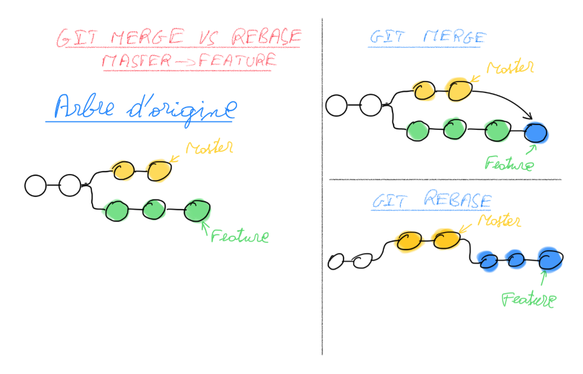
         
* Question 2
     * Dans les cas suivants, quelle(s) méthode(s) devrait-on favoriser entre rebase et merge pour l'intégration de nouveau contenu? (mise à jour de la branche actuelle avec la branche de base)
         * Je travaille seul sur un projet, et je veux que mon arbre soit le plus propre possible : `rebase`
         * Je travaille dans une petite équipe, où chaque tâche (branche) comporte plusieurs collaborateurs. : `merge`
         * Je travaille dans une grosse équipe, où chaque tâche (branche) n'est attribuée qu'à une seule personne. : `merge`
         * Je veux garder l'historique le plus complet possible des branches et de leur intégration. : `merge` 
* Question 3
     * Dans les situations qui suivent, montrez la liste des commandes nécessaires afin d'atteindre le but. Si le but est
       impossible à atteindre ou n'est pas recommandé, expliquez pourquoi
         * J'ai poussé mon commit trop tôt et il y avait des erreurs de compilation. Tout le monde de mon équipe (moi inclus)
           travaille activement sur le projet (dans la même branche). Je viens de corriger l'erreur sur mon poste de travail,
           mais je n'ai encore ni ajouté, ni comité, ni poussé mes modifications. Tous les fichiers que j'ai modifié font
           partie de la correction que je veux envoyer : 
         
            _Dans un premier temps, j'avertis mes coéquipiers du problème afin d'éviter les push pour limiter les resolutions
           de conflits. Puis je fais:_
           
            `git revert <hash du commit erroné>`
             _Puis je commit mes modifications en local :_
           
            `git commit -m <message du commit>` _et enfin_
           
            `git push`

        * Même situation que 1. But: pousser la modification, mais en remplaçant le commit erroné afin que mes coéquipiers ne me jugent pas
          `git reset --soft HEAD~1` _afin d'annuler mon commit de manière locale tout en gardant mes modifications en cours_
          `git commit -m <message du commit>` _Puis:_
          
          `git push -f`

* Question 4
    * Sortie du terminal suite à la commande git log --graph --decorate --pretty=oneline --abbrev-commit --all
      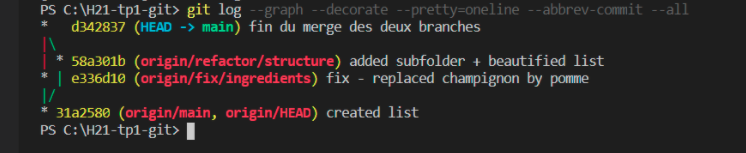
    * Contenu de liste.txt  
      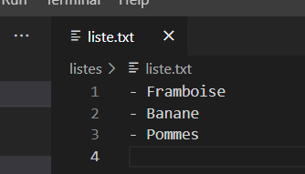
    * Emplacement de `liste.txt` : `./listes/liste.txt`
      
    * Liste des commandes utilisées
    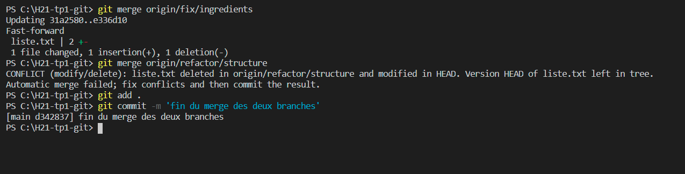

# _Partie 3_
* Question 1(Milestone) 
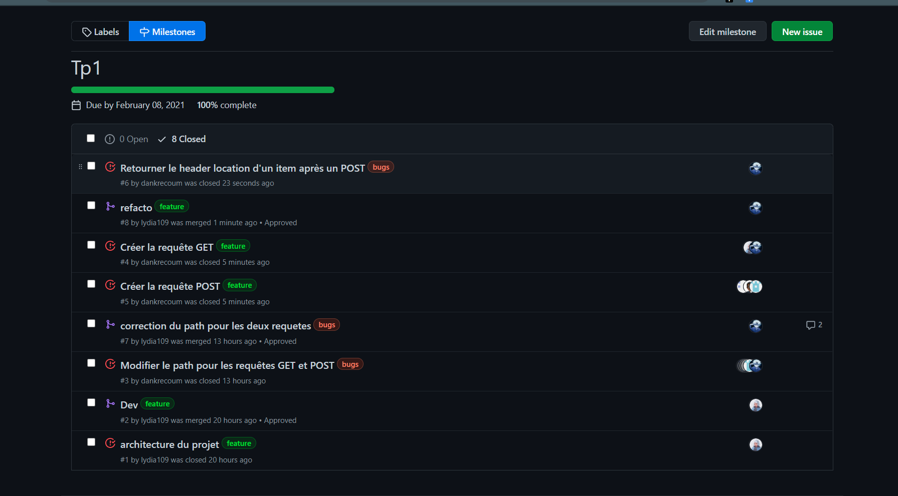

* Question 2(Issues)  
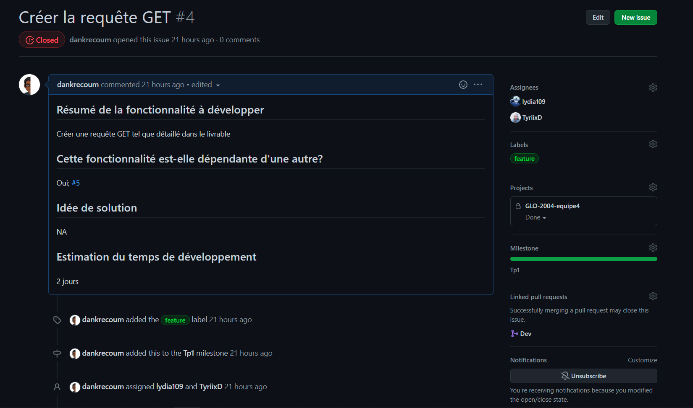  
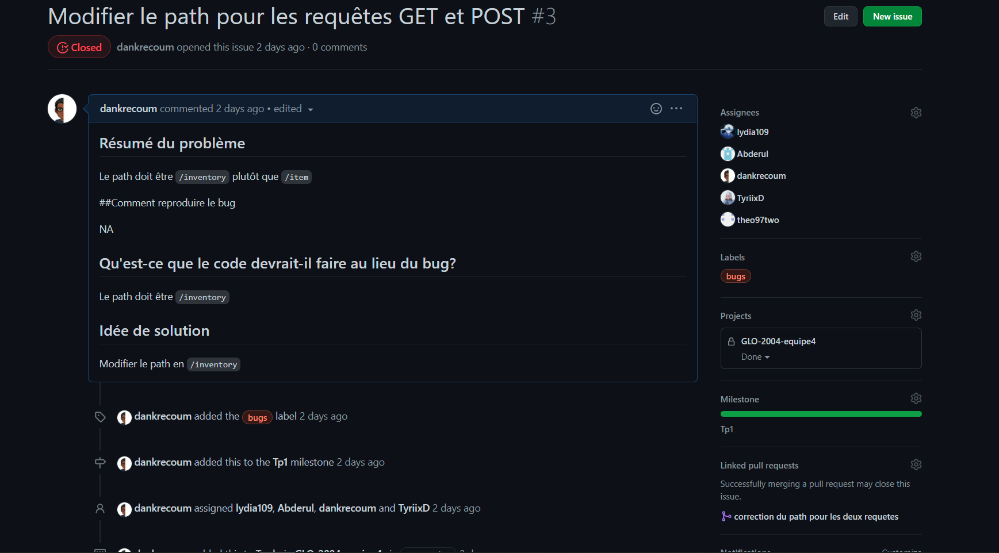  
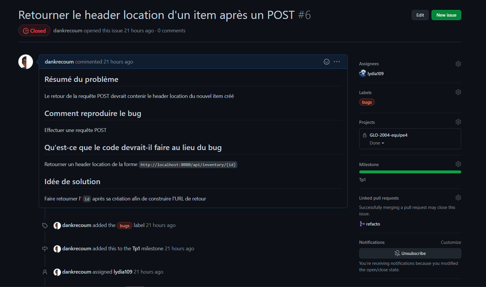  
  
* Question 3(PRs)  
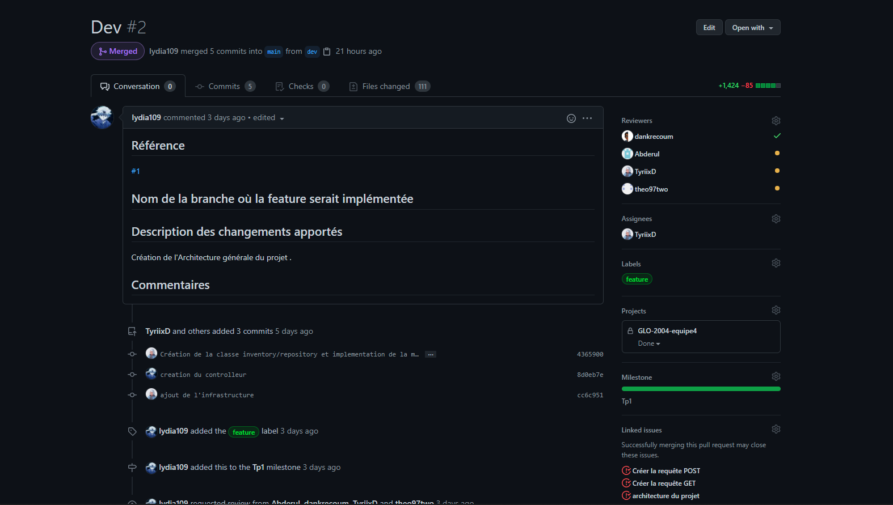  
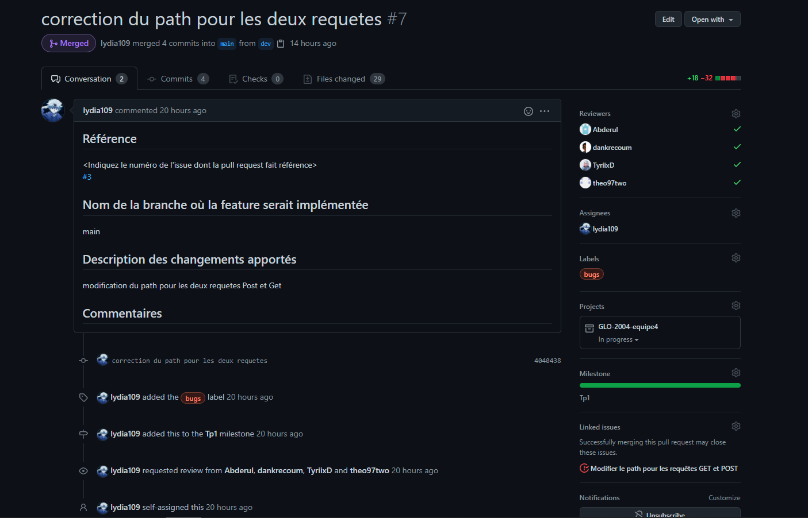  
  
* Question 4 (Github Project)  
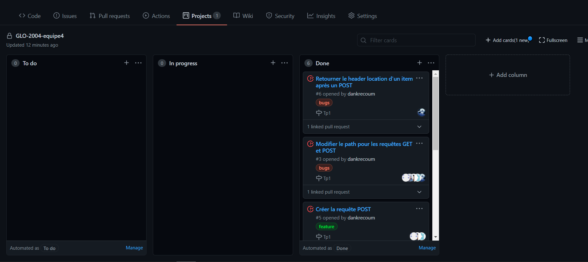