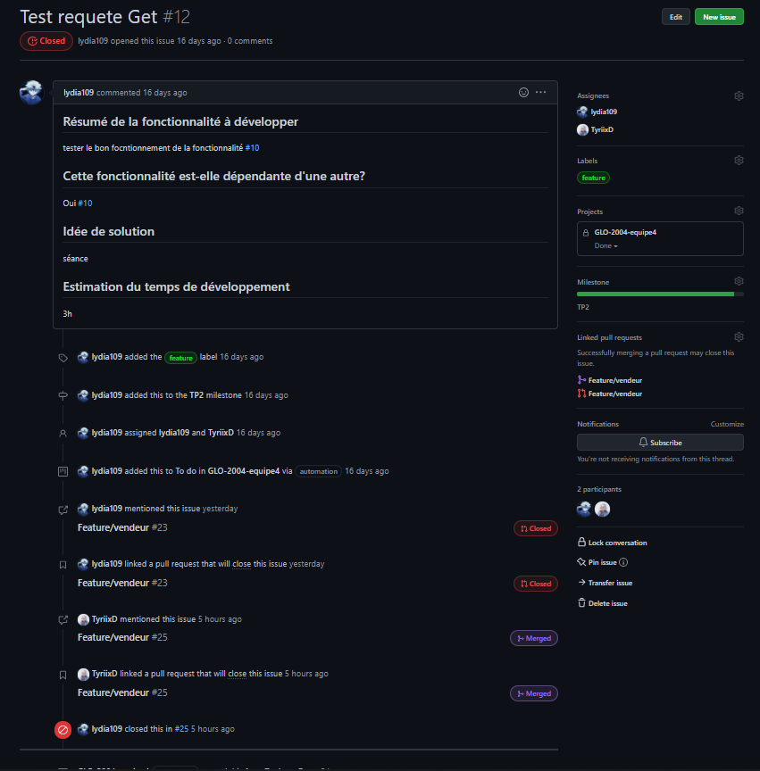
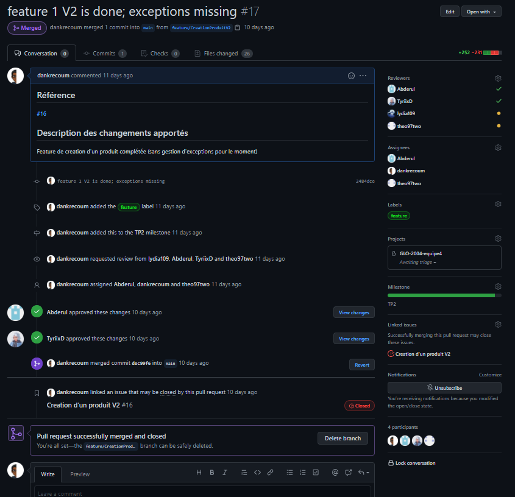

# TP2 - Réponses aux exercices

* Question 1(Milestone) 
  

* Question 2(Issues)  
    
    
    
    
    
    
    
    
    
    

* Question 3(PRs)  
    
    
    
    
    
    
    
    

* Question 4 (Github Project)  
  
  