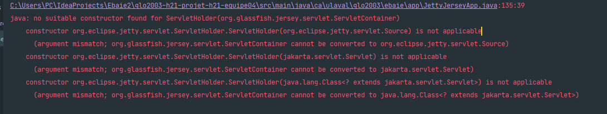

# TP4 - Réponses aux exercices

* Question 1(Milestone) 

* Question 2(Issues)  
    
    

* Question 3(PRs)  

* Question 4 (Github Project)  
##Partie 3 Gestion des dépendances
### 2.1 - Mises à jours des librairies
Apres avoir activer les security updates de Dependabot on a pu voir les pr s'afficher 
pour nous 
 ####2.1.1 Pr de junit:junit => 4.13.1
Le merge etait bien passé , sans conflit la nouvelle version de junit a pu etre integrer dans le pom du master 
####2.1.1 Pr de org.eclipse.jetty:jetty-webapp => 9.4.33
Pour cette pr en premier lieu on a pu mergé la pr dans la branche master 
En essayant de build le code on a eu comme erreur,au niveau du Setup server, que le constructeur de ServletHolder n'accepte pas le 
ServletContainer 
On a essayé de regler le probléme  du build en  castant le paramétre en jakarta.servlet.Servlet ce qui a fait marché le build 
La prochaine étape etait le run de l'api c'est la ou on a remarqué que la solution du cast n'etait pas la bonne car l'api n'arrivait pas à run
On a essayé de regler le probléme en se documentant plus sur l'erreur , notre premiere resource etait la documentation proposé par le  Dependabot
En lisant on a cru comprendre qu'il faut changer la structure de la classe JettyJersyApp et la rendre extend de HttpServlet
En essayant de procéder comme le tutoriel le montrait , nous avons essayé de faire les modifications requises mais chaque modification demandait une autre 
Ce qui nous a rendu la tache plus difficile , on a donc décidé de se concentrer sur le reste du tp . 

## Partie 3 Open Sourcing

### 3.1 Questions
*Qu'avez-vous appris ?*

L'Open Sourcing se rapporte à un ensemble de pratiques permettant de créer un projet tout en le 
laissant libre d'accès à quiconque veut y accéder et/ou y contribuer. Ces projets, en général de logiciels, sont 
gérés par une communauté de personnes ayant des rôles spécifiques(responsables, contributeurs, committeurs).

*Qu'est-ce qui vous a le plus étonné?*

Nous avons été étonnés par l'importance d'une licence dans un projet open source. Ainsi que par la diversité de
domaines et compétences qui interviennent dans la réalisation d'un projet open source. Ces derniers ne sont pas
sont pas seulement de l'ordre de la programmation.

*Qu'est-ce qui va à l'encontre de votre pensée initiale sur l'Open Source?*

Initialement nous pensions que le simple fait d'avoir un repo public était suffisant pour qualifier un projet d'open
source, mais à tort. En effet il est nécessaire d'ajoutter une licence open source au projet afin qu'il puisse l'être.

*Quels sont, selon vous, les 3 principaux bénéfices de l'Open Sourcing?*

Les trois principaux bénéfices de l'open sourcing sont :
 - La facilité de contribution aux projets: Dans un projet open source, il est facile de trouver des contributeurs
sans pour autant engager un salarié. Du point de vue des utilisateurs, la contribution est aussi rendue simple.
 - Le développement de compétences et de l'expérience: L'open sourcing permet aux développeurs d'apprendre d'autres contributeurs, de nouvelles compétences et de développer de nouvelles compétences.
 - L'extension du réseau professionnel: Grâce à l'open sourcing, il est facile d'être en contact avec d'autres professionnels du secteur et ainsi, étendre son réseau de contacts

*Quel est le principal danger de l'Open Source? Comment réduire ce risque?*

Nous avons compris que le principal danger dans un projet open source est la gestion de la qualité du produit développé. En effet, la communauté étant grande et diversifiée, il devient difficile de s'assurer que les différentes contributions respectent un certain critère de qualité. La solution à ce problème est de rédiger certains artefacts tels que le CODE_OF_CONDUCT, le README ainsi que le CONTRIBUTING le plus tôt possible et de l'éditer au besoin afin d'énoncer clairement les attentes quant à la qualité du produit.

### Sources des documents du 3.2:

#### Licence
Nous avons basé notre de choix de license sur le guide du site [choosealicense.com/licenses/mit/](https://choosealicense.com/licenses/mit/)

#### Code de conduite
Nous avons opté pour la *Contributor Covenant Code Of Conduct* qui s'est avérée être selon nos recherches un standard en terme de CODE_OF_CONDUCT auprès de la communauté open source ([Plus de 40 000 projets open Source dont Linux, Kubernetes, Rails,... l'utilisent ](https://www.contributor-covenant.org/adopters/)): [contributor-covenant.org/version/2/0/code_of_conduct](https://www.contributor-covenant.org/version/2/0/code_of_conduct).

#### Contributing
Nous nous sommes inspirés de ce template de CONTRIBUTING.md [github.com/opengovernment/opengovernment/blob/master/CONTRIBUTING.md](https://github.com/opengovernment/opengovernment/blob/master/CONTRIBUTING.md)

## Partie 6 
###Rétro 
## 6.1 Processus 
Premierement nous avons essayé de travailler tous sur une feature , on avait organisé des sceances ou on se partagait l'ecran puis on programmé à tour de role 
Clairement cette façon de faire n'etait pas optimal , on s'est rendu compte qu'on gaspié  trop de temps
Pour remedier à ça on a decidé de partager l'équipe en deux sous-groupe 
Pour nos reunions : on a décidé de faire des rencontres chaque samedi à 18h car la matiére du laboratoire était fraiche dans notre mémoire 
Pour la séparation de taches on a laissé le choix au membres de l'equipe de choisir la feature ou ils se sentaient alaise , en etant equitable dans la séparation.
Apres la séparation des taches , c'etait aux membres du sous-groupe de s'organiser entre eux.
On a trouvé que notre processus etait efficace car on arrivait à liver notre travail à l'heure 
Points positifs :
       La séparation des taches faisant que la surchage du tp avait l'air moins intimidante
       On arrivait à vite livrer des portions de code , ce qui à faciliter la review des membres d'equipe 
Points negatifs :
       Demander de l'aide entre les deux sous-groupe etait un peu difficile . 
       La séparation en sous-goupe a amené une isolation entre les deux sous-groupe
 Amélioration :
        * Rajouter une autre heure de rencontre , car defois on trouvait que faire un point par semaine n'etait pas assez
        * Mieux repartir les taches 
        * Etre plus audacieux pour prendre les taches qui semblaient etre compliquer et hors de la zone du confort du sous-groupe
## 6.2 Outils 
        Discord : outil de communication entre membre de l'equipe.
        Teams  outil d'appel à l'aide 
        Trello : outil d'organisation , séparation de taches 
        
On a aimé l'utilisation du trello car ça nous permis de visualiser la progression du projet , d'assigner les taches
aux membres de l'equipe .
On aurait aimè utiliser le Jira , qui est aussi un outil d'organiation car le Jira offre plus de fonctionnalités comme pouvoir documenter 
la feature et pointer la difficulté .
## 6.3 Architecture
